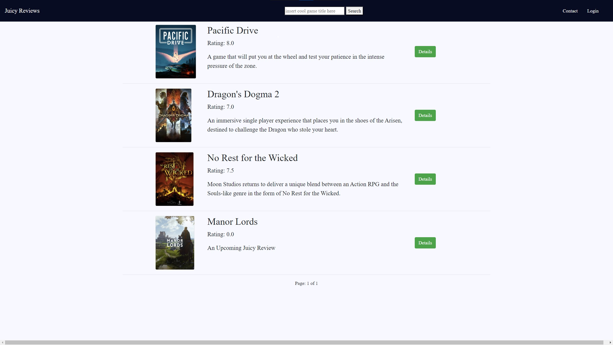
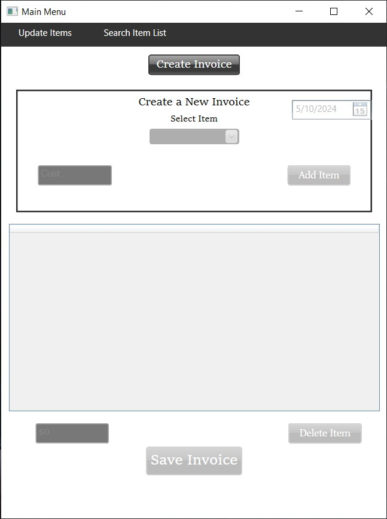

# Software Developer

### Skills
**Programming**
-  C++, C#, Java, Python, Django, SQL, HTML5, CSS, ASP.NET, Windows Software Development, Git/GitHub, Agile Development with Scrum
 
**General Skills**
- Leadership, Analytical Thinking, Time Management, 90 WPM Typing Speed, Communication, Microsoft 365 and Google Workspace

### Education
**Weber State University** | *Bachelor of Science, Computer Science* | Jan. 2024 - Present
- Expected Completion: Spring 2025
- Relevant coursework:
  - Object Oriented Windows Development
  - Server Side Web Development
  - Operating Systems
  - Advanced Database Programming
  - Software Engineering 2
  - Human Computer Interaction (A course for creating highly accessible and functional UI/UX)
   
**Weber State University** | *Associate of Applied Science, Computer Science* | Jan. 2021 - Dec. 2023
- 3.52 overall GPA, with all required CS courses passed with a B- or better.
- Certificate of Proficiency earned in Spring 2023.
- Relevant coursework:
  - Object Oriented Programming
  - Data Structures and Algorithms
  - Client Side Web Development
  - Software Engineering
  - Computer Architecture
      
### Projects
<a href="https://github.com/jstewart4u2c/GameReviewSite" target="_blank">*Game Review Website*</a> - Python/Django
- In March 2024, I decided I wanted to start doing video game reviews on my <a href="https://www.youtube.com/@juicyj4u2c" target="_blank">YouTube</a> channel. I had uploaded a few by the time my Server-Side Web Development class had a final project proposal, and I decided I wanted to make a website for my game reviews that allowed visitors to create an account, view and search games by title, see the rating, the genre, as well as the embedded video on my own website. I am working on adding a comments section below the video, similar to a blog, that would show the signed in user's username, the date, and of course their comment itself in a nice formatted box. Below is an image of the site home page. You are welcome to check out the code and further example images by clicking the title above, or <a href="https://github.com/jstewart4u2c/GameReviewSite" target="_blank">here!</a> This project primarily uses Python and Django, utilizing a virtual environment to install the Pillow, embed video, and setuptools packages.

Game Review Home Page

<a href="https://github.com/jstewart4u2c/InvoiceSystem" target="_blank">*Retail Invoice System*</a> - C#, SQL
- As a final group project for my Object Oriented Windows Applications course, we were put into groups of 3 to create a retail system of some kind in C# using WPF in the .NET Framework. My group designed an invoice system for a jewelry store with functionality to create invoices using a dynamic list of items, search invoices using the invoice number, date, or total cost, and add/update items within the database for use within invoices. The application restricted the deletion of items that were contained on invoices. As this was a 3 person project, I was responsible for the Update Items window and all the code involved with that, including the UI layout and SQL updates for item updates and additions. Although I didn't design the main menu, I have included the picture below for reference. More details and images are included on the repository <a href="https://github.com/jstewart4u2c/InvoiceSystem" target="_blank">here</a>, or you can click the title above!

Retail Invoice System Menu

### Hobbies and Interests
- Tech Research, Building PCs, Basketball, Gaming and Content Creation, LEGO, Audiobooks, Graphic Design, Social Community Management on Discord
